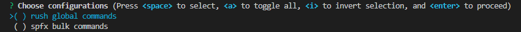
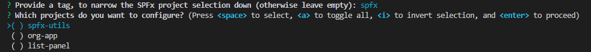

# generator rush-publish

[](https://rushjs.io/)
[](https://yeoman.io/generators/)

> **Important**: This solution is using [ProjectChangeAnalyzer](https://api.rushstack.io/pages/rush-lib.projectchangeanalyzer/) class which is still in **BETA** and may change. It is **NOT recommended** to use this API in a production environment.

## Rush publishing flow

To understand why you may need a custom publish command, let's have a look at the rush flow first.

> There are two stages in a Rush [publishing flow](https://rushjs.io/pages/maintainer/publishing/). The first stage is during development. Developers are asked to provide change files to track changes that deserve a space in change log. The **second stage** is at publishing time. Rush can be used to **gather all change files to increase version, update change log, and publish new packages to a npm registry**.
>

### Independent version policies

When [independent version policies](https://rushjs.io/pages/maintainer/publishing/#publishing-process-when-version-policies-are-used) are used in rush monorepo, the publishing process consists of two steps:

- increase version with `rush version --bump [--target-branch BRANCH]`
- publish packages with `rush publish --include-all`

In this case, the publishing step requires executing `rush publish --include-all` which, despite the documentation ("_will publish all the public packages that have version increased_") seems to [publish all](https://github.com/microsoft/rushstack/blob/831d6737547946d6814c33b8d0ce823664936f54/libraries/rush-lib/src/cli/actions/PublishAction.ts#L239) the packages.

#### increase version

`rush version --bump` versions are increased based on the change files, and change files are deleted. If you specify `--target-branch BRANCH`, changes will be committed and merged into the target branch. Neat!

At this point, the CHANGELOG.json and CHANGELOG.md files for each **changed** project are updated, and the change files are deleted.

> The CHANGELOG.md is always generated based on CHANGELOG.json and should not be manually modified, because your changes will be overriden the next time you run `rush version` or `rush publish --regenerate-changelogs`. If you need to update the change log, **edit the CHANGELOG.json** file.

#### publish packages

According to the documentation, `rush publish --include-all` will publish all the public packages that have version increased. According to the [code]((https://github.com/microsoft/rushstack/blob/831d6737547946d6814c33b8d0ce823664936f54/libraries/rush-lib/src/cli/actions/PublishAction.ts#L239)), it publishes all the projects. And quite understandeably; to publish only changes, rush [needs change files](https://github.com/microsoft/rushstack/blob/831d6737547946d6814c33b8d0ce823664936f54/libraries/rush-lib/src/logic/PublishUtilities.ts#L36), which... were deleted in the previous step.

## Custom publishing flow

This generator **supports publishing** process that does **NOT publish to a npm registry**. Instead, it **executes your custom rush commands** against changed projects, to build packages and to copy them to a destination.

In this case, the publishing process constists of the following steps

- increase version with `rush version --bump [--target-branch BRANCH]`
- update the **CHANGELOG.json** files if needed; do  **not edit CHANGELOG.md**, because it's generated automatically based on the CHANGELOG.json
- publish your packages using `rush dist:package --package-command COMMAND`, where `COMMAND` is a rush "bulk" command.

Since the change files are already deleted, `rush dist:package` uses a workaround: it saves the project's version retrieved from the `package.json` as a **tag** in the `rush.json` file.

When invoked for the first time, the **tag** will be missing, so all the projects will be published. To avoid that, you may manually add `published_v{lastPublishedVersion}` tags, e.g. `published_v1.6.16`

See [rush global commands](./docs/rush_GlobalCommands.md) for a `dist:package` description and usage examples.

## Install the generator

- [Rush](https://rushjs.io/pages/intro/get_started/)
- The latest version of [Yeoman](https://github.com/yeoman/yo) and the `rush-publish` Yeoman generator. To install these tools globally, run the following command:

```bash
npm install -g yo generator-rush-publish
```

- If not done already, configure git and rush:

```bash
git init
rush init
rush update
```

- and follow [Adding projects to a repo](https://rushjs.io/pages/maintainer/add_to_repo/) to configure which projects are managed by rush.

### Use the generator

Deploy the custom commands invoking:

```bash
yo rush-publish
```

This generator comes with optional subgenerator for SharePoint Framework projects. Decide if you want to deploy the [rush global commands](./docs/rush_GlobalCommands.md), or the [rush bulk commands for SPFx](./docs/rush_BulkCommandsSPFx.md), or both.



If you already configured rush global commands and you only want to add the bulk commands to a specific SPFx project, invoke:

```bash
yo rush-publish --spfx-only
```

When deploying **spfx bulk commands**, you will select the projects that should be updated. You may (optionally) define a tag you used in rush.json to narrow the selection down:



#### rush global commands

See [rush global commands](./docs/rush_GlobalCommands.md) for a description and usage examples of the rush global commands deployed by this generator.

#### spfx bulk commands

See [rush bulk commands](./docs/rush_BulkCommandsSPFx.md) for a description and usage examples of the rush bulk commands deployed by this generator.

## Executing custom flow

See [step by step](./docs/custom_publishingFlow.md) instructions on how to use the custom commands in your publishing flow, and [Automation](./docs/cicd.md) for using it in your pipelines.
