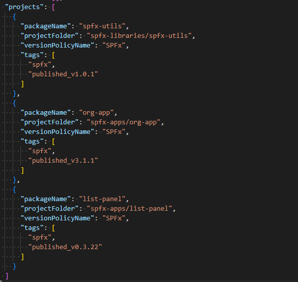

# Automation

## Prerequisites

You may find example azure pipelines in [azure-pipelines](../azure-pipelines/) folder.

### Shallow fetch

New pipelines created after the September 2022 Azure DevOps sprint 209 update have **Shallow fetch enabled** by default and configured with a depth of 1. See [Shallow fetch](https://learn.microsoft.com/en-us/azure/devops/pipelines/yaml-schema/steps-checkout?view=azure-pipelines#shallow-fetch)

### Default branch name

When working locally in your `features/*` branch, you may want to detect changed projects by comparing your commited files with the remote `features/*` branch. To do it, you execute:

```bash
rush change --target-branch BRANCH.
```

If this parameter is not specified, the checked out branch is compared against the "main" branch.
When executed locally, `rush dist:package --prerelease` works the same way.

When executing **CI/CD** pipeline in your `features/*` branch, the comparison needs to be made against the `main` branch; the pipeline invokes

```bash
rush dist:package --prerelease --target-branch main
```

When publishing stable versions, the `rush.json` will be commited to the `main` branch, invoking

```bash
rush dist:package --prerelease --target-branch main
```

>The default branch name is defined in `variables.yml` template. If your default branch is named differently, update the variable.
>
>If you are using `releases/*` branch to publish stable releases, define the `--target-branch` parameter in`releases/releaseNumber` format.

### Grant version control permissions to the build service

`rush dist:package` tags projects, updates `rush.json` and changelog files, and *merges* the changes to the `main` branch.

In order to succesfully tag the projects and save, make sure to [grant version control permissions to the build service](https://learn.microsoft.com/en-us/azure/devops/pipelines/scripts/git-commands?view=azure-devops&tabs=yaml#enable-scripts-to-run-git-commands) on your repository.

If you are running **CI/CD** on main branch, and you don't allow pushing to main branch directly, you also need **Bypass policies when pushing**

.

## Rush publishing flow

>There are two stages in a Rush publishing flow. The first stage is during development. Developers are asked to provide change files to track changes that deserve a space in change log. The second stage is at publishing time. Rush can be used to gather all change files to increase version, update change log, and publish new packages to a npm registry.
>
> How to enforce developers to provide change files
>
> `rush change --verify`
>
>This command fails if a developer modifies a public package without providing related change files. It is recommended to add this command as a step of CI builds so that build fails when change files are missing.
>
>[How to use Rush in your build flow to automate publishing of updated packages](https://rushjs.io/pages/maintainer/publishing)

## Continuous Integration/Continuous Deployment

If you want to automatically build and deploy changed projects whenever you commit changes to the `features/*` branch, you can use [CI/CD](../azure-pipelines/rush-publishx.yml) pipeline which is automatically triggered for `features/*` branches.


Executing the [CI/CD](../azure-pipelines/rush-publishx.yml) pipeline in `features/*` branch will invoke the following command:

```bash
rush dist:package --prerelease `
  --package-command spfx:package-dev `
  --copy-command spfx:copy `
  --target-folder /home/vsts/work/1/a `
  --copied-files ./sharepoint/solution/*.sppkg,./sharepoint/assets/elements.xml `
  --verbose
```

It builds and packages prerelease versions, which you can then deploy to your Development SPO site.


## PR and branch policy

Once you are ready, you will create a Pull Request to merge your changes to the main branch.

To ensure that change files exist for all changed projects, create a [PR](../azure-pipelines/pr.yml) pipeline used in a [branch policy](https://learn.microsoft.com/en-us/azure/devops/repos/git/branch-policies?view=azure-devops&tabs=browser#build-validation) on the `main` branch:


**Path filter** ensures that only changes to the project folders will trigger validation. Editing pipelines, rush confiuguration or `README.md` shouldn't trigger this validation.

If release managers manually execute `rush version`, you may want to exclude `releases/*` branch, becasue `rush change --verify` will fail after the change files have been deleted.

```yml
variables:
  isPR: $[and(eq(variables['Build.Reason'], 'PullRequest'),startsWith(variables['System.PullRequest.SourceBranch'], 'refs/heads/features/'))]

jobs:
  - job: PRBuild
    condition: and(succeeded(),eq(variables.isPR, 'true'))
```

Now, every time you create a Pull Request including changes to the project files, the pipeline will be triggered automatically.
.

If you forget about the change files, the PR will fail. Create them and commit again, the validation will pass.


In case you have to make additional changes, the newly committed files will trigger the build validation again. Since the change files already exist, the validation will pass.

But of course you may mention them in the change files:


## Release management

As a release manager, you will now start preparing release.
Executing `rush version --bump` will update `changelog.json` and `changelog.md` for all changed projects, and delete the change files.
You may edit `changelog.json` file if you want to update the change log. Do NOT edit `changelog.md` directly, as it is alawys overrident based on the `changelog.json` file.

Unless you are allowed to commit directly to the `main`, you need to create a new branch for your release. If you are using the [PR](../azure-pipelines/pr.yml) pipeline described above, make sure that the branch you are working on is NOT `features/*`. You already deleted change files, and `rush change -v` will fail.

Create new branch under `releases/*` for example.

```bash
rush version --bump
# manually review and update changelog.json
# do NOT edit changelog.md, it will be overriden
```

Merging `releases/*` with main branch will not trigger build validation.

Once you are ready to publish and deploy stable version of your packages, you may manually start the  [CI/CD](../azure-pipelines/rush-publishx.yml) pipeline.


If invoked on the `main` branch, the following command will be invoked by the pipeline:

```bash
rush dist:package `
  --package-command spfx:package `
  --copy-command spfx:copy `
  --target-folder /home/vsts/work/1/a `
  --copied-files ./sharepoint/solution/*.sppkg,./sharepoint/assets/elements.xml `
  --verbose
```

It builds and packages stable versions, which you can then deploy to your productive SPO site.


You can use the artifacts in a deployment pipeline [tiggered](https://learn.microsoft.com/en-us/azure/devops/pipelines/process/pipeline-triggers?view=azure-devops) by the **CI/CD** pipeline.

The `rush.json` file is updated to record the last published versions:



**Note:** If you now run this pipeline on the `main` branch again, no artifacts will be published.

`rush dist:package` records published (stable) versions in `rush.json` and only projects with different version numbers are detected.
